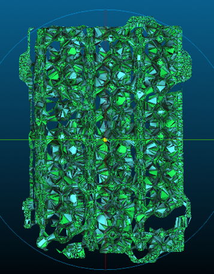
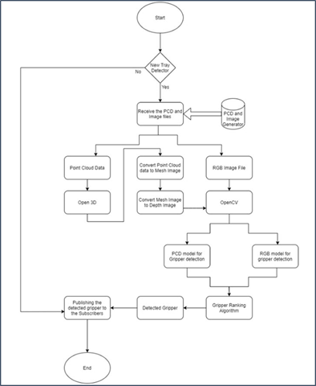

# Gripper Selection using machine vision

Smart Gripper selection for Pick and Place robot using deep learning machine Vision model.


## Authors

- [Akshat Shah](www.linkedin.com/in/akshat-shah-4746b5142)
- [Joffin Sony](https://www.linkedin.com/in/joffinsony/)
- [Rohit Ranjane](https://www.linkedin.com/in/rohit-ranjane/)
- [Vivek Patel](https://www.linkedin.com/in/vivekpatel97/) 


## Roadmap

- AI Approach
- Dataset Collection
- Training Model
- Software Architecture
- Testing
- Docker Container


## Documentation

#### AI approach
- Most of the modern detection models require many GPUs for training and doing it with a large mini-batch size with one GPU makes the training slow and impractical. YOLO object detection addresses this issue by making an object detector that can be trained on a single GPU with smaller batch size. This makes it possible to train a super-fast and accurate object detector.

#### Dataset creation
- The Dataset was hybrid, where 50% of the data was provided by the customer and the remaining 50% was manually designed using SolidWorks(2020) based on the dataset provided by the customer. The goal of this approach was to train the model that can learn the geometric characteristics of the object to classify a gripper instead of learning the object itself. The dataset contained both point cloud (.pcd) and RGB image (.jpg) files.

- The point cloud dataset provided by the customer was not dense enough for object recognition, therefore point cloud was converted into triangular mesh and surface reconstruction algorithm was applied, additionally points were manually sampled on the mesh surface to increase the density.

    PCD             | Mesh   | Depth Image
    :-------------------------:|:-------------------------:|:-------------------------:
      |  |  


    Before Preprocessing             | After Preprocessing
    :-------------------------:|:-------------------------:
      |  


#### Training
- First step to train the model was *labelling*. •	The labelling was done using *Labelimg*. It is a graphical image annotation tool written in python and uses QT for its graphical interfaces. The annotations are saved in a .txt format for YOLO.
    

- Two different models were trained for RGB images and PCD files. The PCD files are in *XYZN* format therefore using *Open3D* and *OpenCV* the PCD data is converted to gradiant depth images.

- Training Parameters:
    -  Batch size – 16 (as the dataset is small, the higher batch size would have increased the inference cost)
    -  Subdivisions – 4
    -  Learning rate – 0.001
    -  Max_batch size – 8000 (2000 iterations per class)
    - Data augmentation method – mosaic
    - Activation method – mish activation

- Training Results.
    - Model performance is based on the comparison of the model's prediction with the known values of the dependent variable in the dataset.
        
        RGB Model             | PCD Model
        :-------------------------:|:-------------------------:
          |  


#### Software Architecture

Architecture              | Flow Chart 
:-------------------------:|:-------------------------:
  |  


## Running Tests


- This module was a part of a microservice architecture. The trigger of this software module was depended on signals recieved from other microservices. The communication was established using ZeroMQ.

- Detection Test
    RGB              | PCD 
    :-------------------------:|:-------------------------:
      |  
        
- Communication Test
    Test 1             | Test 2
    :-------------------------:|:-------------------------:
      |  
        


## Run Locally

- Clone the project

```bash
  git clone https://github.com/Ashah99-git/Gripper_control_vision.git
```

- Go to the project directory

```bash
  cd Gripper_control_vision
```

- Start (For *Docker_detection_model*)

```bash
  cd Docker_detection_model
```
```bash
  docker build –t gripper_selection . // include the '.'
```
```bash
  docker run gripper_selection
```

- Start (For *Docker_with_communication*)

    This is for deployment in the target device which has connection established with the pcd and image generators publishing the pointcloud and rgb data in pub-sub messaging method. also assuming the all the dependent controllers are connected on the same network .


```bash
  cd Docker_with_communication
```
```bash
  docker build –t gripper_selection . // include the '.'
```
```bash
  docker run gripper_selection
```

```bash
  User input is required for the following attributes of ZMQ communication: 

    Example IP addresses and ports to be used by the containers: 
    New tray Detector - IP address:  127.0.0.1 Port: 5000
    Image generator - IP address:  127.0.0.2 Port: 2002
    PCD generator - IP address:  127.0.0.3 Port: 2002
```

- The Subscribers of the gripper selection controller should connect to IP address: 127.0.0.1 Port: 5001 in pub-sub method .

- The build of dockerfile will take apprx 1-2 hr depending on the system capabilities and will be of 5GB .The dockerfile is written to be compatible with arm64 devices since the target device (Jetson nano) is arm64. Hence the above methods will work only on arm64 architecture device.

- To check with different dataset replace the pcd.txt and rgb_image.jpg
